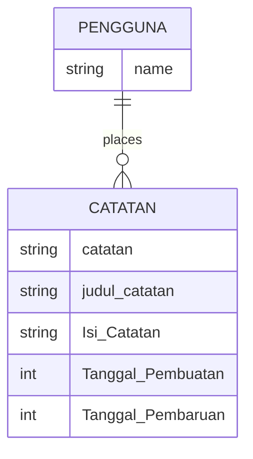
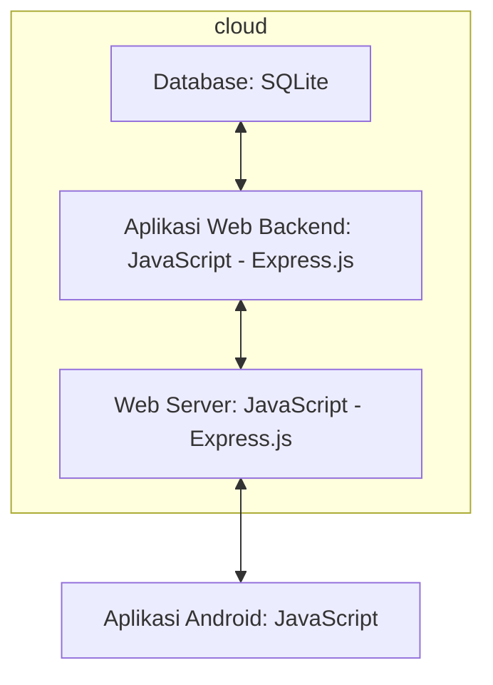

## Membuat aplikasi diary dengan figma, netbeans,java swing,SQLite

Nabila aulia 25 oktober 2023

## Latar Belakang
Diary merupakan salah satu bentuk journal, mengapa aplikasi diary ini dibuat? Dari yang saya ketahui dengan membuat diary kita dapat banyak manfaat contohnya apabila Kita mendapat masalah, selama kita mencatat masalah di dalam diary, kita dapat mencerna apa yang sebenarnya terjadi dan menjadi jalan dalam menentukan jawabannya, selain itu dengan membuat diary juga dapat meredakan stress dan membuat tidur lebih nyenyak, bukan hanya dapat membuat diary saja, aplikasi ini dapat dibuat untuk morning pages, dengan membuat morning pages 3 halaman penuh selama 30 menit, dapat membuat hari kita menjadi lebih baik.

## Deskripsi Teknologi Informasi

Kita dapat mencatat hari kita di aplikasi ini, aplikasi ini dapat membantu anda menuliskan diary,jurnal,catatan,daily activty dan berbagai fitur lainnya apabila telah diperbanyak seperti pengingat aktvitaas kita diantaranya makan,minum,olahraga,ibadah,dapat mencatat to do list dan melihat kalender

## Analysis: Branding

•	Merk: My Riji

•	Tagline: savior of the day

•	Campaign: Aplikasi yang membuat penggunanya dapat mencurahkan isi hati nya

•	Target user: 

•	Usia 13+

•	Seorang yang butuh bercerita

•	Seorang yang butuh self care

•	Seorang yang ingin mengupgrade diri

•	User experience theme:

•	Mudah

•	Sederhana

•	Menenangkan

•	Warna: biru laut

Inspirasi desain:

## Analysis: User Story

| Sebagai | Saya ingin bisa | Sehingga | Priotas |
|---------|---------|---------|---------|
|Pengguna |Menulis diary |Bisa menulis catatan harian|⭐⭐⭐⭐⭐|
|Pengguna |Melihat diary yang telah disimpan|Bisa melihat apa yang telah kita tulis|⭐⭐⭐⭐⭐|
|Pengguna |Melihat kalender|Bisa melihat tanggal|⭐⭐⭐⭐|
|Pengguna |Membuat Todo list|Bisa menjadi pengingat pengguna agar tidak lupa|⭐⭐⭐⭐|
|Pengguna |Membuat planning|Bisa menjadi pengingat pengguna apa yang pengguna rencanakan|⭐⭐⭐⭐|
|Pengguna |Membuat daily activity|Menjadikan pengguna lebih produktif|⭐⭐⭐|
|Pengguna |Melihat fitur self care perawatan|Bisa menjadi pengingat pengguna agar tidak lupa perawatan|⭐⭐⭐|
|Pengguna |Melihat self-care pengingat minum|Bisa menjadi pengingat pengguna agar tidak lupa minum|⭐⭐⭐|
|Pengguna |Melihat self-care pengingat jam tidur|Bisa menjadi pengingat pengguna agar tidak tidur larut malam|⭐⭐|
|Pengguna |Melihat self-care pengingat makan|Bisa menjadi pengingat pengguna agar tidak lupa makan|⭐⭐|
|Pengguna |Melihat self-care pengingat olahraga|Bisa menjadi pengingat pengguna agar tidak lupa olahraga|⭐⭐|
|Pengguna |Melihat self-care pengingat ibadah|Bisa menjadi pengingat pengguna agar tidak lupa ibadah|⭐⭐|
|Pengguna |Melihat kalender moon period|Agar pengguna wanita ingat kapan mulai dan berhenti masa period|⭐⭐|

## Analysis: Structure data

## Design: Arsitektur Berbasis Client-Server

## Design: User Experience (UX) Design

## bagaimana database / sistem basis data berperan dalam produk teknologi informasimu
https://drive.google.com/file/d/1LtTJ-xgb-un6x7f5qbe8wpXqqAhlyK5o/view?usp=drive_link

## bagaimana metode pengembangan perangkat lunak / Software Development Life Cycle berperan dalam produk teknologi informasimu
https://drive.google.com/file/d/1YvYhi_gBh2-mT2k8nvp6JGmtx1MBunIV/view?usp=sharing

## bagaimana algoritma, struktur data, dan bahasa pemrograman berperan dalam produk teknologi informasimu
https://drive.google.com/file/d/1jyZBSayKlqHxtngY--9pCSf58S0KrmTQ/view?usp=drive_link

## bagaimana mesin komputasi dan sistem operasi berperan dalam produk teknologi informasimu
https://drive.google.com/file/d/15o6JRoXuuIMgd7CRVStVXXzdzBafHyMD/view?usp=sharing

## Demonstrasikan produk teknologi informasi yang kamu buat dalam video
https://youtu.be/yg635MC2rGI?si=44xKU7y57D7uB_MI

